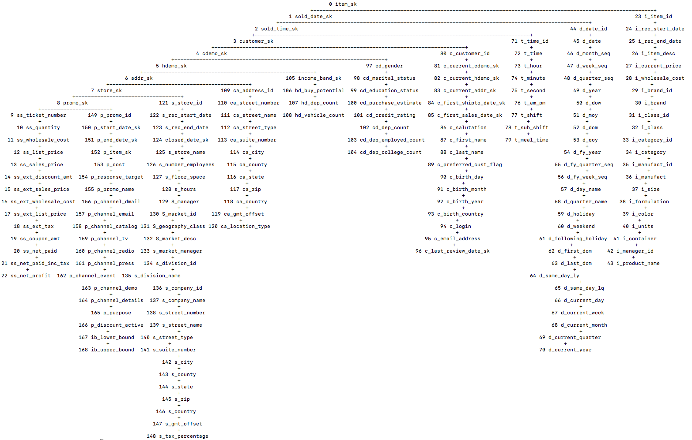
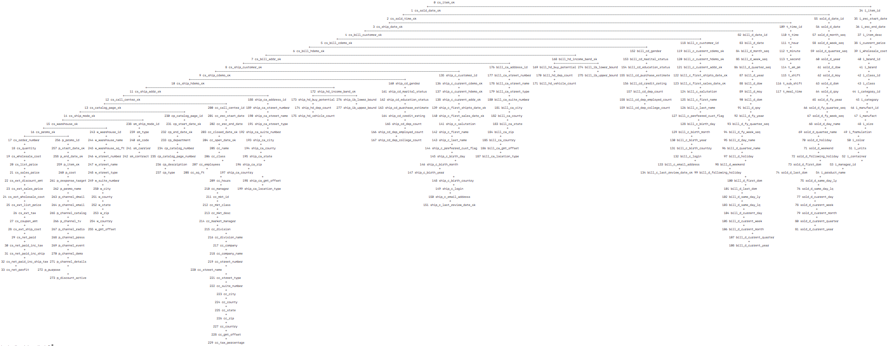
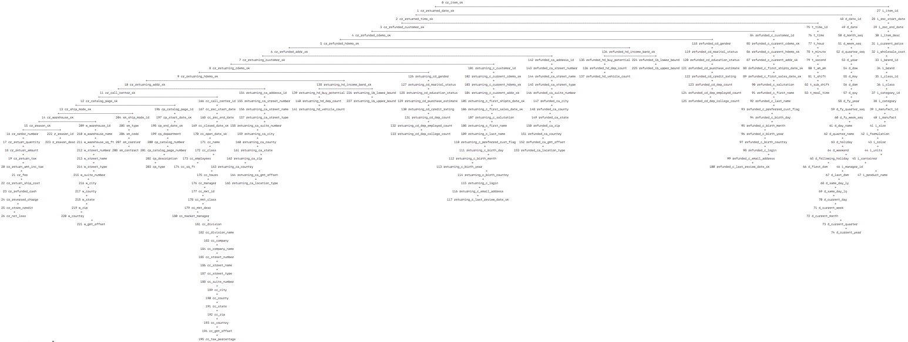
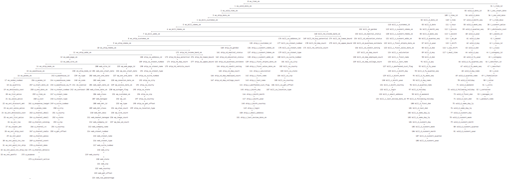
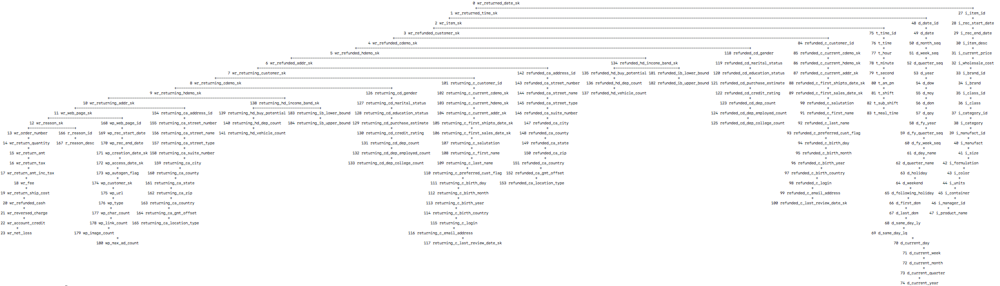

# TPC-DS dataset

TPC-DS models any industry that must manage, sell and distribute products (e.g., food, electronics, furniture, music and toys etc.). It utilizes the business model of a large retail company having multiple stores located nation-wide. Beyond its brick and mortar stores, the company also sells goods through catalogs and the Internet. Along with tables to model the associated sales and returns, it includes a simple inventory system and a promotion system.

The datasets of TPC-DS can be generated using the [program](http://www.tpc.org/tpcds/) and the fully TPC-DS specification can be found on the TPC Documentation [Webpage](http://www.tpc.org/tpc_documents_current_versions/current_specifications.asp).

The config folders contain the config files for the queries. 

## Dataset

The dataset can be downloaded from [https://drive.google.com/open?id=17VFp-6J_-24rk_9-GoQjc3-HHNuOKWSh](https://drive.google.com/open?id=17VFp-6J_-24rk_9-GoQjc3-HHNuOKWSh).

To use the dataset, first uncompress the downloaded file `tpc-ds.tar.gz` by executing `tar -zxvf tpc-ds.tar.gz`. The directory `./tpc-ds` contains the table files. The values in the table files are processed such that string and date values are replaced by integer values, and the mapping of such values can be found in the directory `./tpc-ds/dictionary`. To run the DFDB program on this dataset, copy the query config files to `./tpc-ds` and use the argument `--path` to indicate the path to the data. 

## Schema
The schema of the relations can be found in [schema](schema.md).

## Join Query

### Query 1: Store sales

This query lists the record of sales made in the stores. 
The query is a star join:
the relation `store_sales` is the centre of the query, and the query joins other relations to `store_sales` on the foreign keys. 
The table below lists the foreign keys and the corresponding referenced relations. 

The cardinality of the relation `store_sales` is **28,800,991**.

| Attributes          | Primary Key | Foreign Key   | Referenced Relation    | Cardinality |
|---------------------|-------------|---------------|------------------------|-------------|
| ss_sold_date_sk     |             | d_date_sk     | date_dim               | 73,049      |
| ss_sold_time_sk     |             | t_time_sk     | time_dim               | 86,400      |
| ss_item_sk (1)      | Y           | i_item_sk     | item                   | 102,000      |
| ss_customer_sk      |             | c_customer_sk | customer               | 500,000     |
| ss_cdemo_sk         |             | cd_demo_sk    | customer_demographics  | 1,920,800   |
| ss_hdemo_sk         |             | hd_demo_sk    | household_demographics | 7,200       |
| ss_addr_sk          |             | ca_address_sk | customer_address       | 250,000      |
| ss_store_sk         |             | s_store_sk    | store                  | 102          |
| ss_promo_sk         |             | p_promo_sk    | promotion              | 500         |
| other attributes... |             |               |                        |             |
|                     |             |               |                        |             |

DTree:

Result on the 10GB dataset (with caching):

    Number of values: 597,794,771
    Number of values in Listing Representation: 4,430,918,219
    Number of Tuples in join result: 26,218,451
    Compression Factor: 7.412106

Result:

    Number of values: 378,763,229
    Number of values in Listing Representation: 443,050,907
    Number of Tuples in join result: 2,621,603
    Compression Factor: 1.169731

Result (with caching):

    Number of values: 62,261,456
    Number of values in Listing Representation: 443,050,907
    Number of Tuples in join result: 2,621,603
    Compression Factor: 7.115974

### Query 2: store_returns

This query lists the record of items returned by the customers. 
The query is a star join:
the relation `store_returns` is the centre of the query, and the query joins other relations to `store_returns` on the foreign keys. 
The table below lists the foreign keys and the corresponding referenced relations. 

The cardinality of the relation `store_returns` is **2,875,432**.

| Attributes          | Primary Key | Foreign Key          | Referenced Relation    | Cardinality |
|---------------------|-------------|----------------------|------------------------|-------------|
| sr_returned_date_sk |             | d_date_sk            | date_dim               | 73,049      |
| sr_return_time_sk   |             | t_time_sk            | time_dim               | 86,400      |
| sr_item_sk (1)      | Y           | i_item_sk,ss_item_sk | item                   | 102,000      |
| sr_customer_sk      |             | c_customer_sk        | customer               | 500,000     |
| sr_cdemo_sk         |             | cd_demo_sk           | customer_demographics  | 1,920,800   |
| sr_hdemo_sk         |             | hd_demo_sk           | household_demographics | 7,200       |
| sr_addr_sk          |             | ca_address_sk        | customer_address       | 250,000     |
| sr_store_sk         |             | s_store_sk           | store                  | 102          |
| sr_reason_sk        |             | r_reason_sk          | reason                 | 45          |
| other attributes... |             |                      |                        |             |
|                     |             |                      |                        |             |

DTree:

Result on the 10GB dataset (with caching):

    Number of values: 76,303,321
    Number of values in Listing Representation: 401,295,450
    Number of Tuples in join result: 2,675,303
    Compression Factor: 5.259213

Result:

    Number of values: 34,581,054
    Number of values in Listing Representation: 40,131,900
    Number of Tuples in join result: 267,546
    Compression Factor: 1.160517

Result (with caching):

    Number of values: 9,912,204
    Number of values in Listing Representation: 40,131,900
    Number of Tuples in join result: 267,546
    Compression Factor: 4.048736

### Query 3: Catalog sales

This query lists the record of sales made through the catalog channel. 
The query is a star join:
the relation `catalog_sales` is the centre of the query, and the query joins other relations to `catalog_sales` on the foreign keys. 
The table below lists the foreign keys and the corresponding referenced relations. 

The cardinality of the relation `catalog_sales` is **14,401,261**.

| Attributes          | Primary Key | Foreign Key        | Referenced Relation         | Cardinality |
|---------------------|-------------|--------------------|-----------------------------|-------------|
| cs_sold_date_sk     |             | d_date_sk          | sold_date_dim               | 73,049      |
| cs_sold_time_sk     |             | t_time_sk          | time_dim                    | 86,400      |
| cs_ship_date_sk     |             | d_date_sk          | bill_date_dim               | 73,049      |
| cs_bill_customer_sk |             | c_customer_sk      | bill_customer               | 500,000     |
| cs_bill_cdemo_sk    |             | cd_demo_sk         | bill_customer_demographics  | 1,920,800   |
| cs_bill_hdemo_sk    |             | hd_demo_sk         | bill_household_demographics | 7,200       |
| cs_bill_addr_sk     |             | ca_address_sk      | bill_customer_address       | 250,000      |
| cs_ship_customer_sk |             | c_customer_sk      | ship_customer               | 500,000     |
| cs_ship_cdemo_sk    |             | cd_demo_sk         | ship_customer_demographics  | 1,920,800   |
| cs_ship_hdemo_sk    |             | hd_demo_sk         | ship_household_demographics | 7,200       |
| cs_ship_addr_sk     |             | ca_address_sk      | ship_customer_address       | 250,000      |
| cs_call_center_sk   |             | cc_call_center_sk  | call_center                 | 24           |
| cs_catalog_page_sk  |             | cp_catalog_page_sk | catalog_page                | 12,000      |
| cs_ship_mode_sk     |             | sm_ship_mode_sk    | ship_mode                   | 20          |
| cs_warehouse_sk     |             | w_warehouse_sk     | warehouse                   | 10           |
| cs_item_sk (1)      | Y           | i_item_sk          | item                        | 102,000      |
| cs_promo_sk         |             | p_promo_sk         | promotion                   | 300         |
| other attributes... |             |                    |                             |             |
|                     |             |                    |                             |             |

DTree:

Result on the 10GB dataset (with caching):

    Number of values: 512,103,018
    Number of values in Listing Representation: 3,963,635,040
    Number of Tuples in join result: 14,257,680
    Compression Factor: 7.739917

Result:

    There are 1,427,257 tuples in the database.
    There are 396,777,446 values in the join result.
    There are 363,679,196 values in the factorised join result.
    Count at root: 1,427,257
    Compression rate: 1.09

Result (with caching):

    There are 1,427,257 tuples in the database.
    There are 396,777,446 values in the join result.
    There are 48,156,368 values in the factorised join result.
    Count at root: 1,427,257
    Compression Factor: 8.24

### Query 4: Catalog returns

This query lists the record of items returned by the customers through the catalog channel. 
The query is a star join:
the relation `catalog_returns` is the centre of the query, and the query joins other relations to `catalog_returns` on the foreign keys. 
The table below lists the foreign keys and the corresponding referenced relations. 

The cardinality of the relation `catalog_returns` is **1,439,749**.

| Attributes               | Primary Key | Foreign Key          | Referenced Relation              | Cardinality |
|--------------------------|-------------|----------------------|----------------------------------|-------------|
| cr_returned_date_sk      |             | d_date_sk            | date_dim                         | 73,049      |
| cr_returned_time_sk      |             | t_time_sk            | time_dim                         | 86,400      |
| cr_item_sk (1)           | Y           | i_item_sk,cs_item_sk | item                             | 102,000      |
| cr_refunded_customer_sk  |             | c_customer_sk        | refunded_customer                | 500,000     |
| cr_refunded_cdemo_sk     |             | cd_demo_sk           | refunded_customer_demographics   | 1,920,800   |
| cr_refunded_hdemo_sk     |             | hd_demo_sk           | refunded_household_demographics  | 7,200       |
| cr_refunded_addr_sk      |             | ca_address_sk        | refunded_customer_address        | 250,000      |
| cr_returning_customer_sk |             | c_customer_sk        | returning_customer               | 500,000     |
| cr_returning_cdemo_sk    |             | cd_demo_sk           | returning_customer_demographics  | 1,920,800   |
| cr_returning_hdemo_sk    |             | hd_demo_sk           | returning_household_demographics | 7,200       |
| cr_returning_addr_sk     |             | ca_address_sk        | returning_customer_address       | 250,000      |
| cr_call_center_sk        |             | cc_call_center_sk    | call_center                      | 24           |
| cr_catalog_page_sk       |             | cp_catalog_page_sk   | catalog_page                     | 12,000      |
| cr_ship_mode_sk          |             | sm_ship_mode_sk      | ship_mode                        | 20          |
| cr_warehouse_sk          |             | w_warehouse_sk       | warehouse                        | 10           |
| cr_reason_sk             |             | r_reason_sk          | reason                           | 45          |
| other attributes...      |             |                      |                                  |             |
|                          |             |                      |                                  |             |

DTree:

Result on the 10GB dataset (with caching):

    Number of values: 73852696
    Number of values in Listing Representation: 315185604
    Number of Tuples in join result: 1382393.000000
    Compression Factor: 4.267760

Result:

    Number of values: 28,876,502
    Number of values in Listing Representation: 31,544,484
    Number of Tuples in join result: 138,353
    Compression Factor: 1.09

Result (with caching):

    Number of values: 9,872,871
    Number of values in Listing Representation: 31,544,484
    Number of Tuples in join result: 138,353
    Compression Factor: 3.195067    

### Query 5: Web sales

This query lists the record of sales made through the web channel. 
The query is a star join:
the relation `web_sales` is the centre of the query, and the query joins other relations to `web_sales` on the foreign keys. 
The table below lists the foreign keys and the corresponding referenced relations. 

The cardinality of the relation `web_sales` is **7,197,566**.

| Attributes          | Primary Key | Foreign Key     | Referenced Relation         | Cardinality |
|---------------------|-------------|-----------------|-----------------------------|-------------|
| ws_sold_date_sk     |             | d_date_sk       | sold_date_dim               | 73,049      |
| ws_sold_time_sk     |             | t_time_sk       | time_dim                    | 86,400      |
| ws_ship_date_sk     |             | d_date_sk       | bill_date_dim               | 73,049      |
| ws_item_sk (1)      | Y           | i_item_sk       | item                        | 102,000     |
| ws_bill_customer_sk |             | c_customer_sk   | bill_customer               | 500,000     |
| ws_bill_cdemo_sk    |             | cd_demo_sk      | bill_customer_demographics  | 1,920,800   |
| ws_bill_hdemo_sk    |             | hd_demo_sk      | bill_household_demographics | 7,200       |
| ws_bill_addr_sk     |             | ca_address_sk   | bill_customer_address       | 250,000      |
| ws_ship_customer_sk |             | c_customer_sk   | ship_customer               | 500,000     |
| ws_ship_cdemo_sk    |             | cd_demo_sk      | ship_customer_demographics  | 1,920,800   |
| ws_ship_hdemo_sk    |             | hd_demo_sk      | ship_household_demographics | 7,200       |
| ws_ship_addr_sk     |             | ca_address_sk   | ship_customer_address       | 250,000      |
| ws_web_page_sk      |             | wp_web_page_sk  | web_page                    | 200          |
| ws_web_site_sk      |             | web_site_sk     | web_site                    | 42          |
| ws_ship_mode_sk     |             | sm_ship_mode_sk | ship_mode                   | 20          |
| ws_warehouse_sk     |             | w_warehouse_sk  | warehouse                   | 10           |
| ws_promo_sk         |             | p_promo_sk      | promotion                   | 500         |
| other attributes... |             |                 |                             |             |
|                     |             |                 |                             |             |

DTree:

Result on the 10GB dataset (with caching):

    Number of values: 294,569,693
    Number of values in Listing Representation: 1,999,934,780
    Number of Tuples in join result: 7,194,010
    Compression Factor: 6.789343

Result:

    Number of values: 183,904,076
    Number of values in Listing Representation: 199,888,950
    Number of Tuples in join result: 719,025
    Compression Factor: 1.09

Result (with caching):

    Number of values: 24,236,325
    Number of values in Listing Representation: 199,888,950
    Number of Tuples in join result: 719,025
    Compression Factor: 8.25

### Query 6: Web returns

This query lists the record of items returned by the customers through the catalog channel. 
The query is a star join:
the relation `web_returns` is the centre of the query, and the query joins other relations to `web_returns` on the foreign keys. 
The table below lists the foreign keys and the corresponding referenced relations. 

The cardinality of the relation `web_returns` is **719,217**.

| Attributes               | Primary Key | Foreign Key          | Referenced Relation              | Cardinality |
|--------------------------|-------------|----------------------|----------------------------------|-------------|
| wr_returned_date_sk      |             | d_date_sk            | date_dim                         | 73,049      |
| wr_returned_time_sk      |             | t_time_sk            | time_dim                         | 86,400      |
| wr_item_sk (2)           | Y           | i_item_sk,ws_item_sk | item                             | 102,000     |
| wr_refunded_customer_sk  |             | c_customer_sk        | refunded_customer                | 500,000     |
| wr_refunded_cdemo_sk     |             | cd_demo_sk           | refunded_customer_demographics   | 1,920,800   |
| wr_refunded_hdemo_sk     |             | hd_demo_sk           | refunded_household_demographics  | 7,200       |
| wr_refunded_addr_sk      |             | ca_address_sk        | refunded_customer_address        | 250,000      |
| wr_returning_customer_sk |             | c_customer_sk        | returning_customer               | 500,000     |
| wr_returning_cdemo_sk    |             | cd_demo_sk           | returning_customer_demographics  | 1,920,800   |
| wr_returning_hdemo_sk    |             | hd_demo_sk           | returning_household_demographics | 7,200       |
| wr_returning_addr_sk     |             | ca_address_sk        | returning_customer_address       | 250,000      |
| wr_web_page_sk           |             | wp_web_page_sk       | web_page                         | 200          |
| wr_reason_sk             |             | r_reason_sk          | reason                           | 45          |
| other attributes...      |             |                      |                                  |             |
|                          |             |                      |                                  |             |

DTree:

Result on the 10GB dataset (with caching):

    Number of values: 54,370,149
    Number of values in Listing Representation: 119,077,140
    Number of Tuples in join result: 654,270
    Compression Factor: 2.190120

The results of the query:

    Number of values: 10,128,220
    Number of values in Listing Representation: 11,900,070
    Number of Tuples in join result: 65,385
    Compression Factor: 1.17

Result (with caching):

    Number of values: 3,250,074
    Number of values in Listing Representation: 11,900,070
    Number of Tuples in join result: 65,385
    Compression Factor: 3.66

